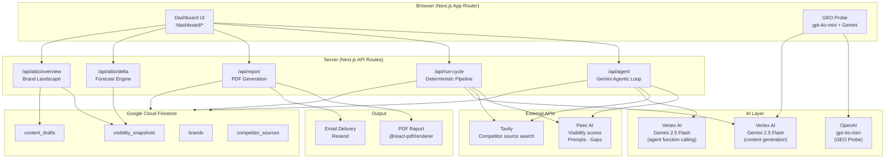

# marktron_

**An autonomous AI marketing agent that monitors brand visibility in AI search results, detects content gaps, and generates drafts to close them — while you sleep.**

---

## What is marktron?

When someone asks ChatGPT, Gemini, or Perplexity "what's the best CRM for revenue operations?", your brand may or may not appear. **GEO (Generative Engine Optimization)** is the emerging discipline of making sure it does.

marktron is a closed-loop GEO agent built for a single brand (Attio by default). It:

1. **Monitors** AI visibility scores daily via the Peec AI API
2. **Detects** gaps where competitors outrank you in AI-generated responses
3. **Researches** what competitor content is winning those gaps
4. **Generates** content drafts to reclaim that ground using Gemini AI
5. **Tracks** whether published content actually moves the needle over time
6. **Forecasts** projected score improvement from approved actions

---

## Architecture



---

## Agent Cycle (How It Works)

The agent runs in two modes:

### Autonomous Agent (`/dashboard/agent`)
Uses Gemini with function calling in an agentic loop. Streams every tool call live to the UI.

```
Phase 1 — parallel, no LLM (instant):
  ├── get_visibility   → Peec AI: overall score + competitor scores
  └── get_gaps         → Peec AI: topics where competitors win

Phase 2 — no LLM (instant):
  └── save_snapshot    → Firestore: historical record for delta chart

Phase 3 — Gemini function calling, tools run in parallel per turn:
  ├── search_sources × 3   → Tavily: competitor URLs + content snippets
  ├── generate_draft × 3   → Gemini: brand-voice content draft per gap
  └── save_draft × 3       → Firestore: pending drafts for human review
```

### Deterministic Pipeline (`/api/run-cycle`)
Same steps without the LLM planning layer — faster, no streaming, used for scheduled runs.

---

## Features

| Feature | Description |
|---|---|
| **GEO Probe** | Simulate how ChatGPT and Gemini rank your brand vs competitors for any prompt |
| **Overview** | Brand landscape with live visibility scores, competitor gaps, activity feed |
| **Visibility Gaps** | Full prompt table from Peec AI with topic, volume, country, priority |
| **Content Queue** | Review, approve, or reject AI-generated content drafts |
| **Peec Delta** | Time-series chart: historical scores + 2-day forecast based on approved drafts |
| **Agent Feed** | Live streaming view of every tool call the agent makes, with collapsible JSON |
| **PDF Report** | One-page visibility report: scores, gaps, actions, forecast — downloadable or emailed |

---

## Tech Stack

### Frontend
| Layer | Technology |
|---|---|
| Framework | Next.js 16 (App Router, TypeScript) |
| Styling | Tailwind CSS v4 with `dark:` variant, CSS custom properties |
| Dark mode | `next-themes` (`attribute="class"`, default dark) |
| Charts | Recharts (`LineChart`, `ReferenceArea`, `ReferenceLine`) |
| Icons | Lucide React |
| Toasts | Sonner |

### Backend
| Layer | Technology |
|---|---|
| Runtime | Next.js API Routes (Node.js, server components) |
| Database | Google Cloud Firestore (Native mode, custom DB `marktron-db`) |
| Auth | Application Default Credentials (ADC) — no service account key files |
| Streaming | Server-Sent Events (SSE) via `ReadableStream` |

### AI & APIs
| Service | Purpose |
|---|---|
| **Peec AI** | Visibility scores, prompt library, gap analysis |
| **Vertex AI / Gemini 2.5 Flash** | Content draft generation |
| **Vertex AI / Gemini 2.5 Flash** | Autonomous agent function calling |
| **OpenAI GPT-4o mini** | GEO Probe — ChatGPT ranking simulation |
| **Tavily** | Competitor source search (web crawl + ranking) |
| **@react-pdf/renderer** | Server-side PDF generation |

### Developer Tooling
| Tool | Purpose |
|---|---|
| **Entire CLI** | Session recording — links AI coding sessions to git commits |
| **Firebase Admin SDK** | Firestore access from server routes |

---

## Data Model (Firestore)

```
brands/{brandSlug}
  ├── name: string
  ├── peec_project_id: string
  ├── is_own: boolean
  └── color: string

visibility_snapshots/{id}
  ├── brand_id: string
  ├── snapshot_date: string          # YYYY-MM-DD, Europe/Berlin timezone
  ├── overall_score: number          # 0–100
  ├── competitor_scores: object      # { "HubSpot": 80, "Pipedrive": 85, ... }
  ├── gap_topics: array              # [{ topic, competitor, gap, your_score, ... }]
  └── created_at: timestamp

content_drafts/{id}
  ├── brand_id: string
  ├── title: string
  ├── body: string
  ├── content_type: string           # blog_post, linkedin, reddit, ...
  ├── target_url: string
  ├── status: "pending" | "approved" | "rejected"
  ├── approved_at: timestamp | null
  └── created_at: timestamp

competitor_sources/{id}
  ├── brand_id, snapshot_id, competitor_name
  ├── source_url, source_type, topic
  ├── tavily_score: number
  └── content_snippet: string
```

---

## Forecast Model

The delta chart projects 2 days forward using:

```
projected_score = current_score + (slope × days) + content_boost

where:
  slope         = (last_score - first_score) / (n_days - 1)
  content_boost = approved_count × avg_gap × 0.08
  avg_gap       = mean of gap_topics[].gap from latest snapshot
```

Forecast lines are dashed in the chart. A vertical `ReferenceLine` separates historical from projected data.

---

## Environment Variables

```bash
# Google Cloud (Firestore + Vertex AI via ADC)
FIREBASE_PROJECT_ID=your-gcp-project-id
FIRESTORE_DATABASE_ID=marktron-db            # optional, defaults to (default)

# Peec AI
PEEC_API_KEY=your-peec-api-key
PEEC_PROJECT_ID=your-peec-project-id

# Tavily (competitor source search)
TAVILY_API_KEY=your-tavily-api-key

# OpenAI (GEO Probe — ChatGPT simulation)
OPENAI_API_KEY=your-openai-api-key

# Resend (PDF email delivery)
RESEND_API_KEY=re_...
REPORT_FROM_EMAIL=reports@yourdomain.com

# App URL (used for absolute links)
NEXT_PUBLIC_APP_URL=https://your-domain.com
```

---

## Local Development

```bash
# 1. Authenticate with Google Cloud (Vertex AI + Firestore via ADC)
gcloud auth application-default login

# 2. Install dependencies
npm install

# 3. Copy and fill environment variables
cp .env.example .env.local

# 4. Start the dev server
npm run dev

# 5. (Optional) Enable Entire session recording
entire enable
```

---

## Project Structure

```
src/
├── app/
│   ├── page.tsx                    # Marketing landing page
│   ├── dashboard/
│   │   ├── agent/page.tsx          # Autonomous agent live feed
│   │   ├── probe/page.tsx          # GEO Probe
│   │   ├── overview/page.tsx       # Brand landscape
│   │   ├── gaps/page.tsx           # Visibility gaps table
│   │   ├── queue/page.tsx          # Content queue
│   │   ├── delta/page.tsx          # Peec Delta chart + forecast
│   │   └── settings/page.tsx       # Settings
│   └── api/
│       ├── agent/route.ts          # SSE agentic loop (Gemini function calling)
│       ├── run-cycle/route.ts      # Deterministic pipeline
│       ├── report/route.ts         # PDF generation + email
│       ├── probe/route.ts          # GEO Probe (ChatGPT + Gemini)
│       └── attio/
│           ├── overview/route.ts
│           └── delta/route.ts
├── components/dash/
│   ├── AppLayout.tsx               # Sidebar, header, nav, theme toggle
│   ├── ProbePanel.tsx              # GEO Probe result card
│   ├── RunProbeBar.tsx             # Probe input + engine selector
│   └── EngineBreakdown.tsx         # Per-engine metrics
└── lib/
    ├── firebase.ts                 # Firestore client (ADC)
    ├── peec.ts                     # Peec AI visibility + gap queries
    ├── peec-client.ts              # Peec brand/prompt data
    ├── tavily.ts                   # Competitor source search
    ├── generator.ts                # Gemini content generation (Vertex AI)
    └── report-pdf.tsx              # PDF document component
```

---

## Powered by

[Peec AI](https://peec.ai) · [Vertex AI](https://cloud.google.com/vertex-ai) · [Tavily](https://tavily.com) · [Entire](https://entire.io)
